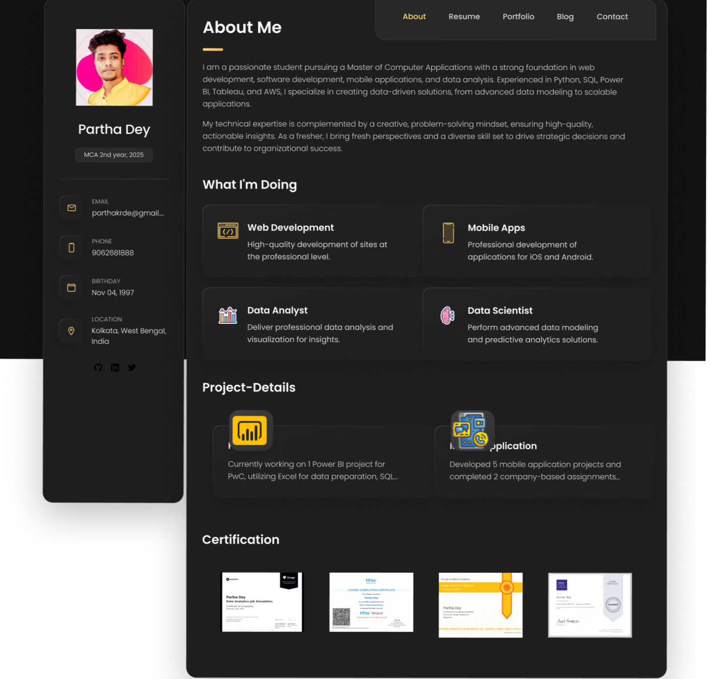
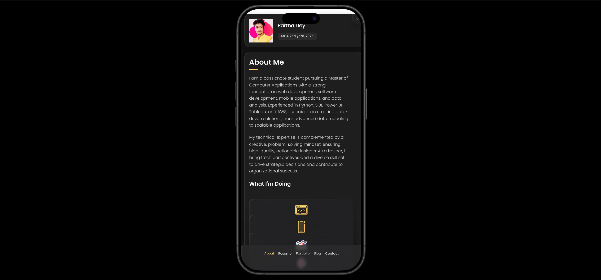

# My Personal Portfolio


[](https://x.com/de_parthaa)
(https://discord.com/channels/@me/746829396907917313)


Portfolio is a fully responsive personal portfolio website, responsive for all devices, built using HTML, CSS, and JavaScript.

## Demo




## Prerequisites

Before you begin, ensure you have met the following requirements:

* [Git](https://git-scm.com/downloads "Download Git") must be installed on your operating system.

## Installing vCard

To install **Portfolio**, follow these steps:

Linux and macOS:

```bash
sudo git clone https://github.com/Parthadee/Portfolio.git
```

Windows:

```bash
git clonehttps://github.com/Parthadee/Portfolio.git
```

## Contact

If you want to contact me you can reach me at [Twitter](https://x.com/de_parthaa).

## License

MIT
